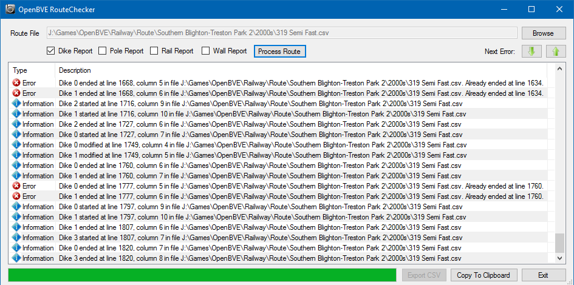

# Open BVE Route Checker

Route Checker is an add-on tool for the [OpenBVE](http://openbve-project.net/) train simulator.

## Purpose

There are a lot of railway routes available for OpenBVE, many of them made for older versions. Many of the available routes also contain errors, either because things have changed since they were made or simply due to human error. Whilst trying to fix some of these errors I discovered that it is very difficult to keep track of elements such as poles, dikes, rails and walls in everything but the shortest of routes, simply due to the numbers of entries that exist for these elements. Each type can have numerous start, stop and modification entries resulting in potentially hundreds or thousands of entries to keep track of. Route Checker can help with this process.

Additionally, many routes were written in the now-deprecated RW format and, whilst this is still supported, the newer CSV format is the preferred option these days and it offers greater facilities for route development. Many of these haven't been updated or converted and it would be a great shame to lose the good work done by the developers of these routes. Route Checker can also convert from RW to CSV format and export a route as CSV so that these routes can be refreshed, enhanced and retained for the future.

## Workflow

The amount of information provided in Route Checker's report can be a bit overwhelming, especially with longer routes or routes that have a lot of problems. Therefore, I suggest the following workflow when working on route corrections or conversions:

* If you are starting with an RW route and intend to convert it to CVS, fix the errors in that first so that Route Checker can convert it cleanly.
* Start by processing the route with the dike, pole, rail and wall reports turned off.
* Correct the errors and warnings that aren't related to these elements.
* Turn on one of the additional reports (dike, pole, rail, wall) and reprocess the route.
* Work through the errors until there are no more.
* Turn off the report you've been working on and select another. 
* Work through the new report until there are no more errors, using the information entries to help you track where the problems occur. 
* Continue in this fashion until you've cleared all four reports.
* Turn on all four reports and check that there are no errors or warnings reported.
* Finally, convert the route to CSV if you wish.

## Example

Coming soon.

## Usage

To use Route Checker, place the application in the root directory of your OpenBVE installation, alongside OpenBVE, Route Viewer, Train Editor and the other tools. Route Checker will not run from anywhere else as it requires access to some core OpenBVE files.

## Credits

Route Checker is based heavily on Route Viewer, which is part of the OpenBVE toolset. Thanks to the following people who have worked on OpenBVE over the years:

**OpenBVE**:

- michelle
- odakyufan
- Anthony Bowden
- Paul Sladen

**OpenTK Port and Continuing Development**:

- Christopher Lees
- Jakub Vanek
- Maurizo M. Gavioli
- Connor Fitzgerald
