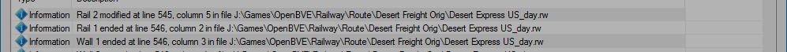

# Example Route Check

I will use the express daytime run from the US Desert Freight route by Steve Green & Bluevoss for this example. It's an interesting route which is a bit different to the usual suburban routes and it has a few problems which I can use to demonstrate the conversion process. I'm using version 3 from November 2002, which you can find [here](http://www.trainsimstuff.org/other-downloads/older-routes/usfreight.zip). The following example assumes that you know the basics, have installed the route normally and know where your route files are stored. If you need help with those aspects please refer to the [OpenBVE web site](http://openbve-project.net/), forum or help facilities. Page 2 of OpenBVE's options will tell you where the files are being stored. Obviously, make sure you have backups or the original package handy before starting to make changes, in case you make a mistake and need to recover.

So, to begin, start Route Checker, click the `Browse` button and load Desert Express US_day.rw. Click `Process Route` and you will see some problems reported.


These are the same errors that are reported by Route Viewer. There are 3 problems that don't appear to relate to dikes, poles, rails or walls, the error related to an invalid paranthesis at line 1084, the warning about an unsupported command at line 702 and the final warning which also refers to line 1084. Let's fix those first. Open Desert Express US_day.rw in your editor of choice and find line 1084.

```
54550@form(0,1,0)@form(2,3,0)@freeobj(1,40)@freeobj(2,39))@freeobj(1,65,1.75)
```

You can see that there's an extra closing parenthesis in the second `freeobj` statement, after the number 39. The keen-eyed among you may have noticed that this is actually visible in the warning. Remove it, save the file and click `Process Route` again. The first error and the final warning are both removed.

Now find line 702 in the route file.

```
26050@railend(2,0,-0.005)@railend(3,-4,-0.005)wallend(3)@wall(1,-1,1)@dikeend(3)@dike(1,-1,4)
```

Commands in RW route files are expected to begin with an `@` symbol. The symbol is missing from the first `wallend` statement so the parser thinks that the command is `@railend(3,-4,-0.005)wallend(3)`, which is invalid. Insert `@` before the `wallend(3)` statement and click `Process Route`. The warning disappears but notice that the error

```
Error		RailIndex 3 is required to reference a non-existing rail in Track.railstart at line 718, column 3 in file J:\Games\OpenBVE\Railway\Route\Desert Freight Orig\Desert Express US_day.rw
```

has also been removed. This error was caused by the failure of the `railend` command in the previous issue, which resulted in rail 3 still being in existence when `railstart` was encountered at line 718, causing an error. Happy days!

The remaining errors look like they relate to rails and other elements that Route Checker can report on, so turn on the rail report by checking `Rail Report` and click `Process Route` again. Notice that Route Checker reports an error in addition to the 5 warnings that remained on the previous report.


The next problem is at line 325. It's useful here to know that OpenBVE re-uses rail numbers. If a rail that's assigned the number 2 is ended, the number can be reallocated to a new rail that starts subsequently. The same is true for dikes, poles and walls so it's normal to see elements with the same numbers starting and stopping numerous times in a single report.

With the rail report active, you can now see that rail 2 was ended at line 233 and no new rail 2 was started prior to line 325.

```
4900@railtype(0,10)@railend(2,-4,0)
```

Therefore, the railend statement is invalid and you can remove it.

```
4900@railtype(0,10)
```

__<span style="color: #96C120;">Note:</span>__ You can skip information lines and jump to the next or previous error or warning using the `Next Error` buttons at top right. This saves scrolling and makes it easy to get to the problems you're actually trying to fix.

Save the file and process the route again. The next problem, a warning, needs to be viewed with the error that follows it. Since it relates to a dike, turn off the rail report, turn on the dike report and reprocess the route.


Now it's easier to see the problem. Dike 1 (a dike on rail 1) was ended at line 321 and another dike with that number isn't started until line 337. Therefore, referencing dike 1 at line 326 is invalid, as described by the warning.

```
4925@ground(21)@dikeend(1)@dikeend(0)@railtype(0,11) 

```

So you can remove the `dikeend` statement for dike 1 at line 326.

```
4925@ground(21)@dikeend(0)@railtype(0,11) 

```

Reprocessing now shows that the error has been corrected.

The dike report has also found some problems that weren't previously reported, so let's deal with those.


Looking at line 355 of the route, you can see the following:

```
5975@railend(1,0,-0.005)@dikeend(1)@wallend(1)@dikeend(1)@dike(0,-1,2)
```

There are 2 statements ending dike 1. Since there are no other errors that suggest that it might have been the author's intention to end a dike other than dike 1, you can remove one of these statements.

```
5975@railend(1,0,-0.005)@dikeend(1)@wallend(1)@dike(0,-1,2)
```

Reprocess the route.


Looking at line 1048 of the route, you can see the following:

```
53150@wallend(0)@height(4)@railtype(0,10)@dikeend(0)@railstart(7,-20,0,0)@wall(7,-1,1)@dike(7,1,5)
```

You can see from the preceding line of the report that dike 0 was ended at line 1046 so remove the `dikeend` statement for dike 0 from line 1048.

```
53150@wallend(0)@height(4)@railtype(0,10)@railstart(7,-20,0,0)@wall(7,-1,1)@dike(7,1,5)
```

Reprocessing the route shows that that problem is now resolved. The remaining warnings look like they relate to walls and rails. Let's deal with the walls next. Turn off the dike report, turn on the wall report and reprocess the route. Again there are some additional errors reported.


The first warning is suggestive of the problem but the error that follows makes it clear. Wall 1 was ended at line 430, as you can see by looking 6 lines above, so referencing it at line 451 is invalid.

```
13325@rail(5,-4,0)@freeobj(0,13,11,0,0)@height(0)@dikeend(0)@wallend(0)@wallend(1)@railstart(1,-4,0,0)@curve(0,0)@freeobj(5,39)@ground(2)
```
So you can remove the `wallend` statement for wall 1.

```
13325@rail(5,-4,0)@freeobj(0,13,11,0,0)@height(0)@dikeend(0)@wallend(0)@railstart(1,-4,0,0)@curve(0,0)@freeobj(5,39)@ground(2)
```

There are 4 more errors of the same kind reported. Fix those exactly the same way, by removing the invalid `wallend` statements.

That leaves 3 warnings, the first of which appears to refer to a wall, so let's see what we can do about that. This one is interesting. 


To see what's happening to rail 2, turn on the rail report as well as the wall report and reprocess. Use the `Next Error` button to skip down to the warning. Rail 1 isn't mentioned in nearby rows but, if you scroll up or make the window taller, you'll see it 36 rows higher up, ending on line 546 of the route.



Rail 1 does start again 5 rows lower down than the warning but what does that mean? Should the rail start earlier? Should the wall relate to a different rail? Let's investigate further.

Start Route Viewer, press F7 and load the Desert Express US_day.rw file that you've been working on. Notice that it shows that 3 error messages were generated. If you press F9 you will see that they look very familiar. That's reassuring. Now, look at line 594 of the route file again.

```
20400@wall(1,-1,1)
```

That number at the start of the line is the distance from the start of the route, in metres, so this wall is 20400 metres along the route. Go back to Route Viewer and on the main screen type 20400 and press `Return`. You will see the numbers appear at the top left of the screen, under the red error message. You'll also see that the prompt "Jump to track position" appears at that location once you start typing.


After you press `Return`, you will be moved to the requested location along the route.


There isn't anything wall-like visible at this location. The second number in the `wall` command, -1, means that the structure should be on the left of the rail. You can move back and forward along the line using the `W` and `S` keys but that doesn't reveal anything significant in this location. There also aren't any other rails visible here. We're sitting on rail 0 so maybe that's the rail that should be used by the `wall` statement. Change the rail number, i.e. the first digit, to 0 in the route file.

```
20400@wall(0,-1,1)
```

Now return to Route Viewer and press F5 to reload the route. Et voila! The missing wall.


So this "wall" is a cliff face. Very nice! You can use `S` to move the viewing position back down the track a short way to see that the wall starts at 20400m.


Return to Route Checker and reprocess the route. A new error is reported due to the last change.


Remove the `wallend` statement from line 685, as before, and reprocess. Only 2 warnings remain. The first looks like a rail problem so switch to the rail report and reprocess the route.


The warning now comes with an error. You should be getting the hang of this by now. 

```
29175@rail(3,2,-0.005,15)@form(0,-9,0)@railtype(5,4)@rail(4,6,-0.005,15) 
```

Changing the rail type of rail 5 looks like an error here because rail 5 ended at line 778. Looking at the 29175m location in Route Viewer and experimenting with different rail numbers in `railtype` also doesn't produce anything that looks right. The rails at this location appear correct as they are so remove the `railtype` statement from line 793.

```
29175@rail(3,2,-0.005,15)@form(0,-9,0)@rail(4,6,-0.005,15) 
```

Reprocess the route. 1 warning left. The `freeobj` statement at line 796 is attempting to add some scenery at the specified location but rail 6 doesn't exist at that location.

```
29250@rail(3,0,-0.005,20) @wallend(8) @freeobj(6,11,18,0,0) ;r3 now on lhs
```

In Route Viewer, after reversing a short way to improve the view, that space on the right looks suspicious.


Rails 4 and 5 aren't present here either so, rather than lose the scenery, try changing `freeobj` to use rail 3. Rail 3 restarts on this line so that seems reasonable and the more there is to look at, the merrier.
 
```
29250@rail(3,0,-0.005,20) @wallend(8) @freeobj(3,11,18,0,0) ;r3 now on lhs
```

Reloading the route in Route Viewer now shows us a building on the right.


That looks good and fits with the buildings of the same kind that lead up to this spot, so let's keep it there.

Reprocessing the route reveals no more warnings. Now turn on all reports and reprocess to check that there are no problems of any kind reported then, finally, turn off all reports and reprocess one last time.


Lovely! That leaves one final task. Conversion to CSV. Click the `Export CSV` button at the bottom of the window. A default name is provided. Change it if you wish and hit `Save`. You can load the CSV into Route Checker and run the reports if you want to check that it converted correctly. The new route should work correctly and without generating errors in Route Viewer or OpenBVE.

## Postscript

The route still isn't perfect. For example, the power line on the left of the tracks now disappears into the wall we replaced and reappears at the far end. Shortly thereafter it pitches up as if climbing over an obstacle (our wall?) and disappears into thin air. It restarts abruptly about 1000m further down the track. This looks like a design flaw. Maybe I'll look at that in another tutorial. It's still a great route, though, and the glitch doesn't detract from the overall enjoyment of driving it. I'm still impressed at the quality of the work that deigners were able to create with minimal tooling, especially in the early days of BVE.

I have also fixed some other bugs not shown above and created packages for the route and its trains using the new package features. You can find those [here](./usf.md) if you want to compare your results or just enjoy the route.

Have fun converting routes and don't forget to make them available for others to enjoy!
