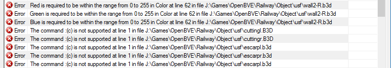
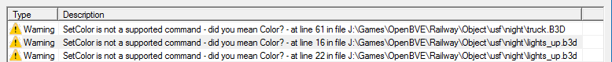
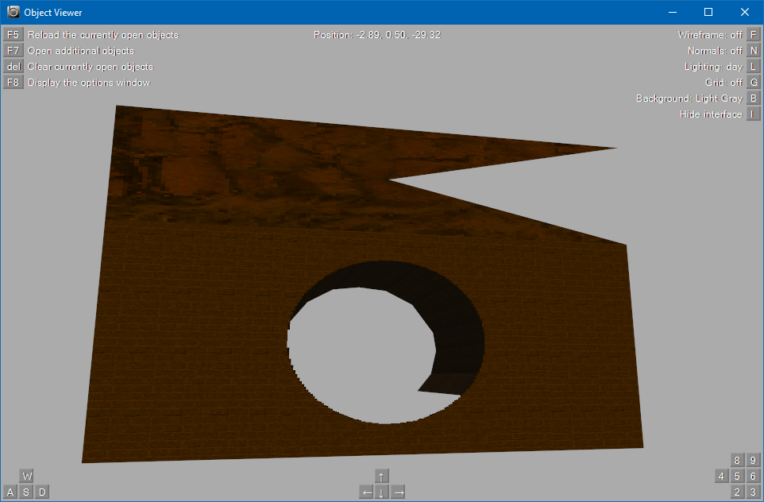
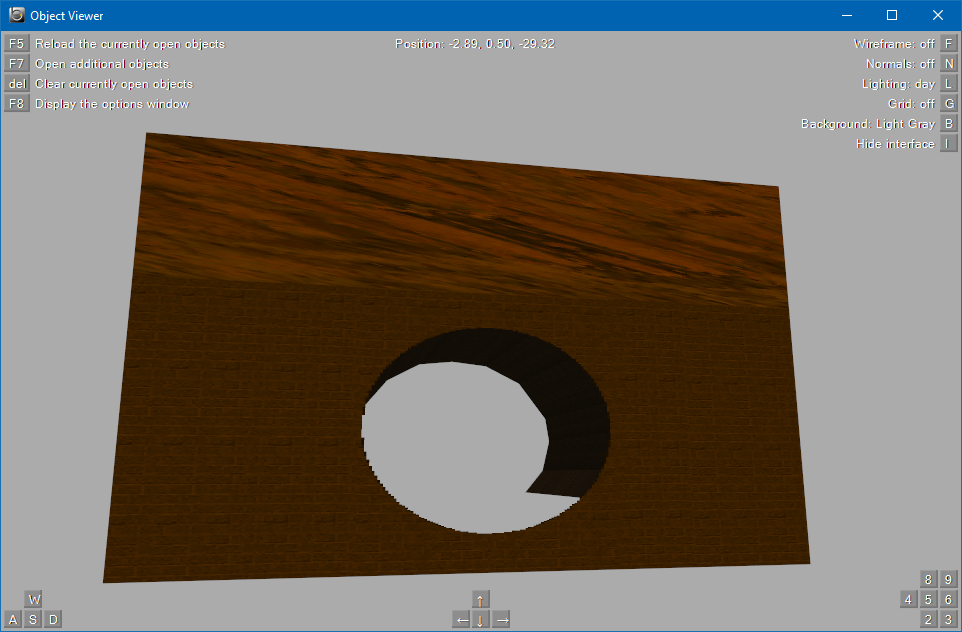

# US Desert Freight Packages

In addition to the errors shown in the example, I have corrected some errors in the scenery objects used by the route. These should come up in the general report but I may have already fixed them before I wrote the example. Restoring the original object directory and loading the newly converted Desert Freight US_day.csv into Route Viewer produced 132 errors. 



There are many of these kinds of errors but they're easily fixed. Open Wall2-L.b3d in your editor and look at line 62.

```
Color 260, 260, 260
```

You just need to change `260` to `255`.

```
Color 255, 255, 255
```

I'm not sure whether these values are the result of some other conversion or application doing the wrong thing or something else but, since 255 is the maximum acceptable value for a colour, bringing it back into range solves the problem. Reloading Route Viewer shows that 3 errors have been corrected. You can check the object in Object Viewer before and after the change to see that there is no visible effect. You can now fix all errors of this type that are reported. You will find other values greater than 255 that need correcting, as well.

Next, there is a large number of errors reported regarding the command `:(c)`. Open cuttingl.b3d in your editor. You'll see that line 1 starts this way.

```
:(c) STEVE GREEN 2002
```

It's just Steve asserting his copyright but comments should start with a semi-colon. Do a bulk replace across the entire /objects/usf directory to replace the colon with a semi-colon to fix these.

```
;(c) STEVE GREEN 2002
```

Again, since documentation for the RW format is sparse, it's unclear whether this was something that was acceptable in older routes or just an error.

Loading Desert Freight US_night.csv generates a different error.



`SetColor` is a CVS format command so this one also looks like a bug. Changing these commands to `Color`, as the report suggests, should deal with them.

If you have problems with the files not being UTF-8 and comment lines causing errors now that they start with a semi-colon, just add a space after the leading semi-colon or remove them.

There is also a visual glitch in the bridge object, bridge.b3d, which looks like this.



No error is reported, it just looks wrong. Change your position to 1220m in Route Viewer to see the first instance. I re-ordered the vertices in the first `MeshBuilder` block to fix this.

```
[MeshBuilder]
Vertex -10.8, 8.05, 0   <--
Vertex 17.6, 8.05, 0
Vertex -10.8, 14.05, 0
Vertex 17.6, 14.05, 0
Face2 0, 1, 2, 3
color 160,80,0
```



```
[MeshBuilder]
Vertex 17.6, 8.05, 0
Vertex -10.8, 8.05, 0   <--
Vertex -10.8, 14.05, 0
Vertex 17.6, 14.05, 0
Face2 0, 1, 2, 3
color 160,80,0
```

Do the same for the nighttime scenario version in \Night. Its unclear why this occurred. It could be the result of OpenBVE doing things differently to older versions of BVE. You should now be free of errors in objects.

Having done the work, I thought I'd try and package it using the new packaging features of OpenBVE 1.5. It's necessary to package the trains separately. Here they are for anyone who'd like to try out the converted and corrected version. You'll need to right-click and "Save link as..." to get around GitHub's limitations.

[US Desert Freight route package](./Packages/USFreightRoute.zip)

[US Desert Freight train package](./Packages/USFreightTrains.zip)

The copyright for this work remains with Steve Green & Bluevoss. Thanks guys.